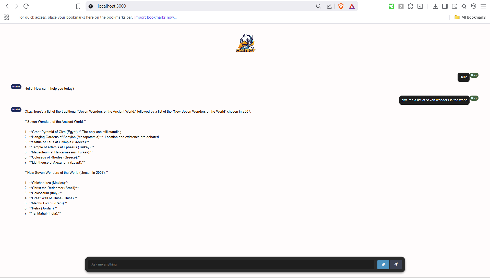

# node-gemini-ai-chatbot-
A chatbot using Node JS and Gemini API

This project provides a practical demonstration of how to integrate the Google Gemini API to build a chatbot using Node.js. It serves as a foundational example for developing conversational AI applications.

## ✨ Features
Gemini API Integration: Seamlessly connects with the Gemini API for natural language understanding and generation.

Node.js Backend: A lightweight and efficient server-side implementation using Node.js.

Configurable Port: Easily adjust the server's port for flexible deployment.

## How to Run the Project
Follow these simple steps to get the chatbot up and running on your local machine:

1. Open terminal in your desired folder
2. Run: git clone https://github.com/tailornp/node-gemini-ai-chatbot-.git
3. Run: cd node-gemini-ai-chatbot
4. Run: npm intall
5. Create an .env file in the root folder, add your Gemini API key as "GEMINI_API_KEY".
6. By default the port is set to 3000. To customize port add "PORT" in the .env file;
Note: You can obtain a free Gemini API Key from the Google AI Studio.

7. Run: npm run server.js
The server will typically run on http://localhost:3000 (or your specified port).

This project serves as a starting point, demonstrating the core integration, which can then be expanded and customized for many use cases such as E-commerce assistance and Customer Support & FAQs:.
